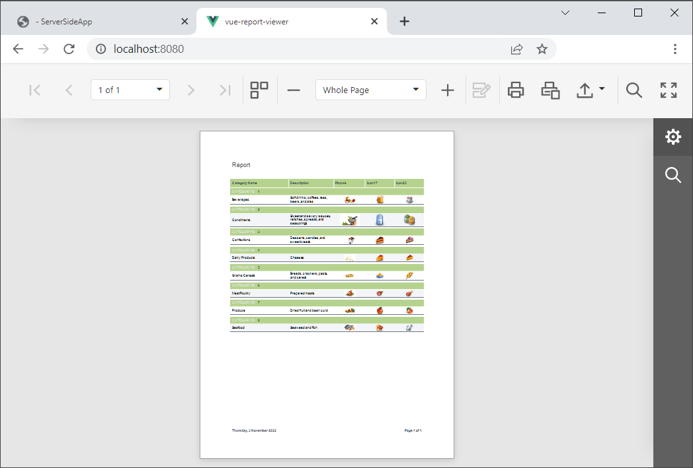

<!-- default badges list -->

[](https://supportcenter.devexpress.com/ticket/details/T848267)
[](https://docs.devexpress.com/GeneralInformation/403183)
[](#does-this-example-address-your-development-requirementsobjectives)
<!-- default badges end -->
# Reporting for Vue - Integrate a Web Document Viewer into a Vue App

This example incorporates the Web Document Viewer into a client-side app built with Vue. The example consists of two parts:

- The [ServerSideApp](ServerSideApp) folder contains the backend project. The project is an ASP.NET Core application that enables [cross-domain requests (CORS)](https://developer.mozilla.org/en-US/docs/Web/HTTP/CORS) (Access-Control-Allow-Origin) and implements custom web report storage.

- The [vue-document-viewer](vue-document-viewer) folder contains the client application built with Vue.

## Quick Start

### Server

In the *ServerSideApp* folder, run the following command:

```
dotnet run
```

The server starts at http://localhost:5000. To debug the server, run the application in Visual Studio.

### Client

In the *vue-document-viewer* folder, run the following commands:

```
npm install
npm run serve
```

Open your browser (http://localhost:8080/) to see the result. The application displays the Web Document Viewer.



## Files to Review

- [Viewer.vue](vue-docuemnt-viewer/src/components/Viewer.vue)
- [main.js](vue-report-viewer/src/main.js)
- [HomeController.cs](ServerSideApp/Controllers/HomeController.cs)
- [CustomReportStorageWebExtension.cs](ServerSideApp/Services/CustomReportStorageWebExtension.cs)
- [Program.cs](ServerSideApp/Program.cs)

## Documentation

- [Document Viewer Integration in Vue](https://docs.devexpress.com/XtraReports/401539)

<!-- feedback -->
## Does this example address your development requirements/objectives?

[](https://www.devexpress.com/support/examples/survey.xml?utm_source=github&utm_campaign=reporting-vue-integrate-web-document-viewer&~~~was_helpful=yes) [](https://www.devexpress.com/support/examples/survey.xml?utm_source=github&utm_campaign=reporting-vue-integrate-web-document-viewer&~~~was_helpful=no)

(you will be redirected to DevExpress.com to submit your response)
<!-- feedback end -->
